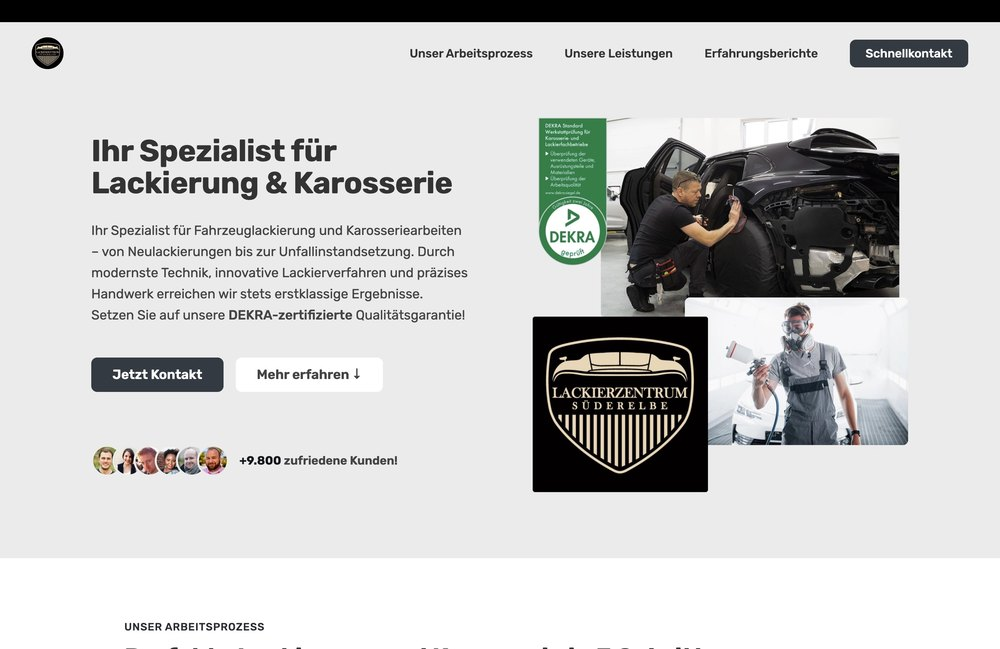
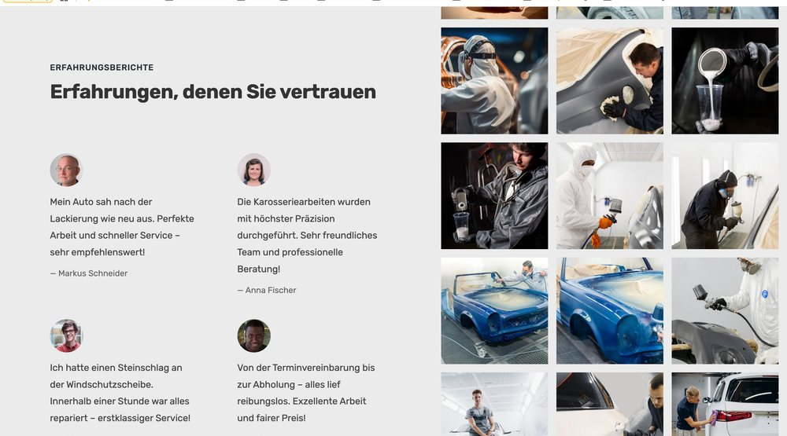

# Lackierzentrum Süderelbe

Offizielle Website der **Lackierzentrum Süderelbe GmbH** – Fachbetrieb für Fahrzeuglackierung und Karosseriearbeiten in Neu Wulmstorf bei Hamburg. Eine moderne, **performante** und vollständig **responsive** Single-Page-Website mit Fokus auf **kurze Ladezeiten**, **konsequente Bildoptimierung** und **Suchmaschinenoptimierung (SEO)**.

[](https://www.lackierzentrum-suederelbe.de)


**Live-Website :** <https://www.lackierzentrum-suederelbe.de>

---

## Vorschau

<p align="center">
  
</p>

<p align="center">
  
</p>

## Überblick

Das **Lackierzentrum Süderelbe** ist ein DEKRA-zertifizierter Fachbetrieb für Fahrzeuglackierung und Karosseriearbeiten – von Neulackierungen bis zur Unfallinstandsetzung – mit Sitz in Neu Wulmstorf bei Hamburg und über 9.800 zufriedenen Kunden. Dieses Repository enthält die offizielle Unternehmenswebsite: eine klare, vertrauensbildende Präsentation der Leistungen, Referenzen, Zertifizierungen und Kontaktmöglichkeiten.

Ziel der Website ist es, das Leistungsspektrum professionell darzustellen und Interessenten einen direkten Weg zur Terminvereinbarung zu bieten – bei minimalen Ladezeiten und optimaler Darstellung auf jedem Gerät.

## Funktionen

- **Startseite mit Hero-Bereich** – zentrale Botschaft, Vertrauenssignale (DEKRA, Kundenzahl) und klare Handlungsaufforderung.
- **Unser Arbeitsprozess** – Darstellung der wichtigsten Schritte von der Anfrage bis zur Fertigstellung.
- **Unsere Leistungen** – Übersicht der angebotenen Lackier- und Karosseriearbeiten.
- **Erfahrungsberichte & Galerie** – echte Kundenstimmen sowie eine Bildergalerie der ausgeführten Arbeiten mit Lightbox-Ansicht.
- **Zertifizierungen** – strukturierte Darstellung der Qualitätsnachweise (DEKRA, ISO 9001:2015, TÜV Nord, EMAS).
- **Standort & Öffnungszeiten** – eingebettete Google-Maps-Karte sowie aktuelle Servicezeiten.
- **Schnellkontakt-Formular** – direkte Terminanfrage per Formular (EmailJS), ergänzt durch Telefon und E-Mail.
- **Impressum** – rechtskonforme Anbieterkennzeichnung inklusive Hinweis zur EU-Online-Streitbeilegung.
- **Social-Media-Anbindung** – Instagram, TikTok, Facebook und YouTube.

## Performance, Ladezeiten & Responsivität

Ein zentraler Schwerpunkt der Umsetzung lag auf **schnellen Ladezeiten**, einer **konsequenten Bildoptimierung** und einer fehlerfreien Darstellung auf allen Bildschirmgrößen:

- **Bildkompression & -optimierung** – alle Aufnahmen werden komprimiert und passend dimensioniert ausgeliefert, um Dateigrößen und damit die Ladezeit deutlich zu reduzieren.
- **Lazy Loading** – Bilder werden erst bei Bedarf geladen, was die initiale Ladezeit der Seite spürbar verkürzt.
- **Schlanker Code & minimierte Anfragen** – reduzierte externe Ressourcen für eine geringe Übertragungsmenge.
- **Globales CDN & HTTPS** – Auslieferung über das Netlify-CDN mit automatischer SSL-Verschlüsselung für schnelle und sichere Verbindungen.
- **Responsives Layout** – Flexbox und Grid, korrekte `viewport`-Konfiguration sowie optimierte mobile Navigation und Touch-Bedienung; getestet in Chrome, Firefox, Safari und Edge.

## SEO & Auffindbarkeit

Die Seite wurde gezielt für eine gute Platzierung in Suchmaschinen aufgebaut:

- **Semantische HTML5-Struktur** für eine klare inhaltliche Gliederung.
- **Meta-Tags** (Titel, Beschreibung) und **Open-Graph-Daten** für aussagekräftige Vorschauen in Suchergebnissen und sozialen Netzwerken.
- **Aussagekräftige Alt-Texte** für sämtliche Bilder.
- **Saubere URL-Struktur** sowie lokale Standortdaten (Google Maps) zur Stärkung der regionalen Auffindbarkeit.

## Technische Architektur

Die Website ist als statische Single-Page-Anwendung in nativem JavaScript umgesetzt – ohne Framework. Das Layout basiert auf CSS3 mit Flexbox und Grid. Das Kontaktformular wird über **EmailJS** verarbeitet, sodass Nachrichten ohne eigenes Backend versendet werden. Die Icons stammen von Ionicons, die Schriften von Google Fonts. Die Auslieferung erfolgt über Netlify mit automatischer HTTPS-Verschlüsselung.

| Bereich | Technologien |
| --- | --- |
| Sprachen | HTML5, CSS3, JavaScript (ES6+) |
| Layout | CSS3 Flexbox & Grid |
| Icons & Schriften | Ionicons, Google Fonts |
| Kontaktformular | EmailJS |
| Karte | Google Maps (Einbettung) |
| PWA | Web App Manifest (`manifest.webmanifest`) |
| Hosting | Netlify (CDN, automatisches SSL) |

## Projektstruktur

```
Lackierzentrum-Suederelbe-Deutschland/
├── index.html             Startseite und Haupteinstieg der Website
├── impressum.html         Rechtskonforme Anbieterkennzeichnung
├── manifest.webmanifest   Web App Manifest (PWA)
├── _redirects             Routing-Regeln für das Hosting (Netlify)
├── css/                   Stylesheets (Layout & Design)
├── js/                    Anwendungslogik, Galerie-Lightbox und Formularverarbeitung
└── img/                   Bildmaterial, Referenzaufnahmen und Screenshots
```

## Lokale Installation

```bash
git clone https://github.com/R3zgar/Lackierzentrum-Suederelbe-Deutschland.git
cd Lackierzentrum-Suederelbe-Deutschland

# Website über einen statischen Server ausliefern
npx serve .
# oder
python3 -m http.server 8000
```

Die Website ist anschließend unter `http://localhost:8000` erreichbar.

## Deployment

Die Website ist live unter <https://www.lackierzentrum-suederelbe.de> erreichbar. Das Hosting erfolgt über **Netlify** mit global verteiltem CDN und automatischer SSL-Verschlüsselung.

## Kontakt

**Lackierzentrum Süderelbe GmbH**

- **Adresse :** Kantstraße 10, 21629 Neu Wulmstorf, Deutschland
- **Telefon :** +49 40 55 611 082
- **Fax :** +49 40 55 611 083
- **E-Mail :** info@lackierzentrum-suederelbe.de

**Öffnungszeiten**

| Tag | Zeiten |
| --- | --- |
| Mo – Fr | 07:00 – 17:00 Uhr |
| Sa | 08:00 – 12:00 Uhr |
| So | geschlossen |

**Zertifizierungen :** DEKRA Werkstattprüfung · ISO 9001:2015 · TÜV Nord · Umweltzertifikat nach EMAS

**Social Media :** Instagram, TikTok, Facebook und YouTube – @lackierzentrum_suederelbe

## Autor

Entwickelt von **Rzgar BAPIRI** – <https://github.com/R3zgar>

## Lizenz

Projekt realisiert für die Lackierzentrum Süderelbe GmbH. Alle Rechte vorbehalten.
